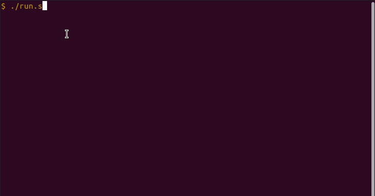

# How it works



```bash
[Usage]: run.sh

[Parameters]:
 -d directory
 -t "title"
 -k "task description"
 -s "status" (open, done, close, breakfast, lunch, dinner, pause)

[Example]: ./run.sh -d example -k "my first task" -s open

[Help]: ./run.sh -h

[Interactive mode]: ./run.sh -i (press CTRL+C to exit)

[Warning]: Important to use 'space' remember of quotes "hello world"
```

# 1. Execute
```bash
cd daily-blog
chmod +x run.sh
./run.sh -d example -k "my first task" -s done
```

## 1.1 Output
```bash
Directory example_teste was created.
File example_teste/20211217.md was created.
Time-Task was added in  example_teste/20211217.md

----------------- START -----------------
# Daily 17/12/2021
[🌃][01:16:44] - create folder with space [✅]<br />

----------------- END -----------------
```
## 1.2 File created
Will be created directory and file with follow name example/{timestamp}.md
```markdown
# Daily 17/12/2021
[🌃][00:41:58] - my first task [✅]<br />
```

# Configure
Copy .env.example to .env
```bash
cp .env.example .env
```
### Env Variables
- export DIR='directory'
- export DISPLAY_STYLE='table' | 'log'

### Tips & Tricks
- if set **DIR** in **.env** you can omit parameter **-d** in ```./run.sh -t title -k "task"```
